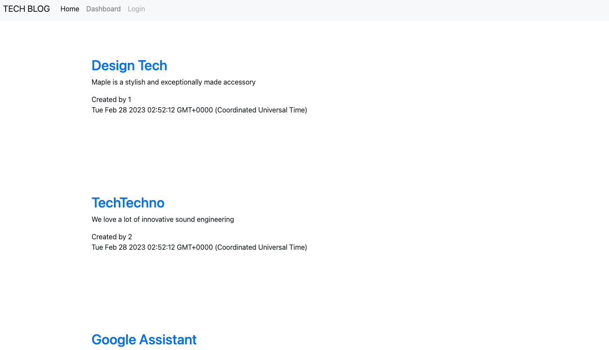

<h1 align="center">MVC-TechBlog</h1>
 

 
<p align="center">
    
    
    
    
    
    
    
    
    
</p>
   
## Description

"MVC Tech Blog" is a website using the Model-View-Controller format, a mysql database using database modellingis done through the Sequelize ORM for MySQL. Built using MySQL2, Express, express-handlebars, express-session, Sequelize, bcrypt and dotenv.

The motivation was to create a blog site where you can keep up to date with latest technology and it would give the user the ability to make their own posts and comments.

Heroku deployment link: https://mvc-techblog-am.herokuapp.com/

;
## Table of Contents
* [Description](#description)
* [Installation](#installation)
* [Usage](#usage)
* [Testing](#testing)
* [Credits](#credits)
* [Questions](#questions)


## Installation  
 
### Cloning the Repository

Click `<> code` - the green button. After clicking, in the local tab, copy the SSH key. Open the terminal in your Macbook or [git bash](https://git-scm.com/downloads), if you have Windows/Linux, and type:

```bash
git clone [paste ssh key]
```

I would recommend downloading [Visual Studio Code](https://code.visualstudio.com/download) to edit the code locally. If you need more information on how to clone a repository, [click here](https://docs.github.com/en/repositories/creating-and-managing-repositories/cloning-a-repository)!

 
## Usage

Please find code here:

@github.com:mriya20/MVC-TechBlog.git
 
Run the following command at the root of your project and answer the prompted questions:

`mysql -u root -p`

Enter your mysql password when promted


`source db/schema.sql`

`quit`

`npm i`

`npm run seed`
 
`npm start`

## Testing

All testing done through Insomnia and using the LocalHost.
 
## License
 


Please see LICENSE for details

## Credits
* Georgia Institute of Technology - Coding Bootcamp
* GitHub
* Youtube.com
* U2 Tutors

 
## Questions

If you have any questions about the project you can contact me via the links below
   
* 📧 [Email](mailto:anastasia19markova@gmail.com)

   
* 💻 [GitHub](https://github.com/mriya20)